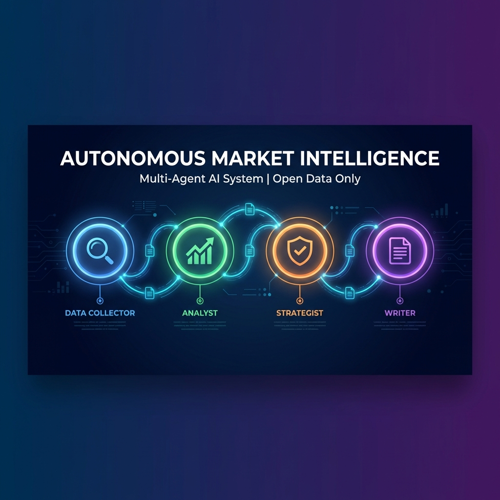
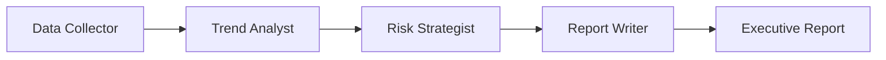

# 🤖 Autonomous Market Intelligence System



<div align="center">


**An advanced multi-agent AI system that autonomously collects, analyzes, and synthesizes market intelligence using only open-source data.**

[Features](#-features) • [Architecture](#-architecture) • [Installation](#-installation) • [Usage](#-usage) • [Documentation](#-documentation)

</div>

---

## 📋 Overview

This project demonstrates **autonomous multi-agent market intelligence** using only open-source data, designed for executive decision-making. Built with CrewAI and powered by Claude AI, it employs four specialized agents that work sequentially to produce consulting-grade market intelligence reports.

### 🎯 Key Highlights

- **100% Open Data**: Uses only publicly available sources (Wikipedia, GitHub, RSS feeds)
- **Multi-Agent Architecture**: Four specialized AI agents working in sequence
- **Executive-Ready Output**: Concise, actionable reports (1-2 pages)
- **Powered by Claude**: Leverages Anthropic's Claude Sonnet 4 for superior reasoning
- **Fully Autonomous**: End-to-end analysis with minimal human intervention

---

## ✨ Features

### 🔍 Intelligent Data Collection
- **Wikipedia Integration**: Industry overviews and market context
- **GitHub Trends Analysis**: Technology adoption patterns
- **RSS Feed Monitoring**: Latest industry news and developments

### 🧠 Advanced Analysis
- **Trend Identification**: Automated detection of market signals
- **Risk Assessment**: Strategic risk and opportunity analysis
- **Impact Ranking**: Prioritized insights by business impact

### 📊 Professional Reporting
- **Executive Summaries**: CEO-level briefings
- **Actionable Recommendations**: Clear next steps
- **Source Attribution**: Full transparency on data sources

---

## 🏗️ Architecture

The system employs a **sequential multi-agent workflow**:



### Agent Roles

| Agent | Role | Responsibility |
|-------|------|----------------|
| 🔎 **Data Collector** | Market Research | Gathers data from Wikipedia, GitHub, RSS feeds |
| 📈 **Trend Analyst** | Pattern Recognition | Identifies 3-5 key market trends with evidence |
| ⚖️ **Risk Strategist** | Strategic Planning | Maps trends to risks and opportunities |
| ✍️ **Report Writer** | Executive Communication | Synthesizes insights into actionable reports |

---

## 🚀 Installation

### Prerequisites

- **Conda** (Anaconda or Miniconda)
- **Anthropic API Key** ([Get one here](https://console.anthropic.com/))

### Setup Steps

1. **Clone the repository**
   ```bash
   git clone https://github.com/thiyanayugi/Autonomous-Market-Intelligence-System-Using-Multi-Agent-AI-CrewAI-.git
   cd "Autonomous Market Intelligence System Using Multi-Agent AI (CrewAI)"
   ```

2. **Create Conda environment**
   ```bash
   conda env create -f environment.yml
   conda activate market-intelligence
   ```

3. **Configure API credentials**
   ```bash
   # Create .env file
   echo "ANTHROPIC_API_KEY=your_api_key_here" > .env
   ```

---

## 💻 Usage

### Basic Usage

Run analysis on the default industry (AI Tools Market):
```bash
python -m src.main
```

### Custom Industry Analysis

Analyze any industry or market:
```bash
python -m src.main "Electric Vehicle Market 2024-2026"
python -m src.main "Renewable Energy Sector"
python -m src.main "FinTech Innovations"
```

### Output

The system generates a comprehensive report saved as `market_intelligence_report.md` with:
- Executive Summary
- Market Overview
- Key Trends (ranked by impact)
- Risks & Opportunities
- Strategic Recommendations
- Data Sources & Assumptions

---

## 📁 Project Structure

```
.
├── src/
│   ├── __init__.py
│   ├── agents.py          # Agent definitions
│   ├── tasks.py           # Task configurations
│   ├── tools.py           # Custom data collection tools
│   ├── crew.py            # Crew orchestration
│   └── main.py            # CLI entry point
├── environment.yml        # Conda dependencies
├── requirements.txt       # Pip dependencies (alternative)
├── .env.example          # Environment variables template
└── README.md             # This file
```

---

## 🛠️ Configuration

### Environment Variables

| Variable | Description | Required |
|----------|-------------|----------|
| `ANTHROPIC_API_KEY` | Your Anthropic API key | ✅ Yes |

### Model Configuration

The system uses **Claude Sonnet 4** by default. To change the model, edit `src/agents.py`:

```python
llm = LLM(
    model="claude-sonnet-4.0",  # Change model here
    temperature=0.7              # Adjust creativity
)
```

Available models: `claude-sonnet-4.0`, `claude-opus-4.0`, `claude-haiku-4.0`

---

## 📖 Documentation

### Custom Tools

The system includes three custom data collection tools:

- **`wikipedia_search`**: Searches Wikipedia for industry information
- **`github_trends_search`**: Analyzes trending GitHub repositories
- **`rss_feed_reader`**: Monitors RSS feeds for latest news

### Adding New Tools

Create a new tool in `src/tools.py`:

```python
@tool("Your Tool Name")
def your_custom_tool(query: str) -> str:
    """Tool description for the AI agent."""
    # Your implementation
    return result
```

Then add it to agents in `src/agents.py`:

```python
tools=[wikipedia_search, github_trends_search, your_custom_tool]
```

---

## 🎓 Use Cases

- **Market Entry Analysis**: Evaluate new market opportunities
- **Competitive Intelligence**: Track competitor movements and trends
- **Technology Scouting**: Identify emerging technologies
- **Investment Research**: Support due diligence processes
- **Strategic Planning**: Inform quarterly planning cycles

---

## 🤝 Contributing

Contributions are welcome! Please feel free to submit a Pull Request.

1. Fork the repository
2. Create your feature branch (`git checkout -b feature/AmazingFeature`)
3. Commit your changes (`git commit -m 'Add some AmazingFeature'`)
4. Push to the branch (`git push origin feature/AmazingFeature`)
5. Open a Pull Request

---

## 📄 License

This project is licensed under the MIT License - see the [LICENSE](LICENSE) file for details.

---

## 🙏 Acknowledgments

- **CrewAI** - Multi-agent orchestration framework
- **Anthropic** - Claude AI models
- **LangChain** - Tool integration framework

---

## 📧 Contact

**Thiyanayugi Mariraj**

- GitHub: [@thiyanayugi](https://github.com/thiyanayugi)
- Project Link: [Autonomous Market Intelligence System](https://github.com/thiyanayugi/Autonomous-Market-Intelligence-System-Using-Multi-Agent-AI-CrewAI-)

---

<div align="center">

**⭐ Star this repository if you find it helpful!**

*"This project demonstrates autonomous multi-agent market intelligence using only open-source data, designed for executive decision-making."*

</div>
